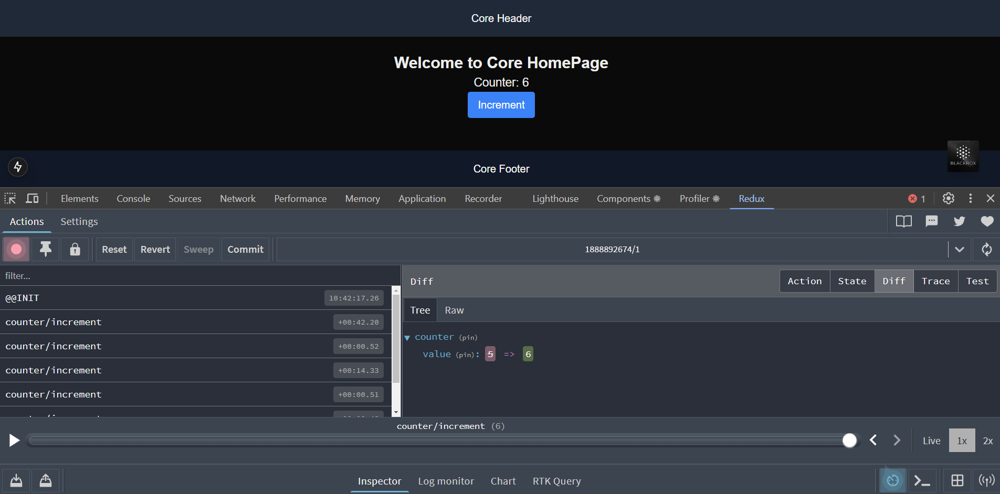

This is a [Next.js](https://nextjs.org) project bootstrapped with [`create-next-app`](https://nextjs.org/docs/app/api-reference/cli/create-next-app). This project is a Proof of Concept (POC).

## Project Structure

```
nextjs-core/
├── app/
│   ├── layout.tsx        // Root layout
│   ├── page.tsx          // Example homepage
│   └── providers.tsx     // Redux Provider wrapper (client component)
├── components/
│   └── Button.tsx
├── redux/
│   ├── store.ts
│   └── counterSlice.ts
├── utils/
│   └── capitalize.ts
├── index.ts
├── package.json
├── tsconfig.json
├── next.config.js
├── postcss.config.js
├── tailwind.config.js
```

## Getting Started

First, run the development server:

```bash
npm run dev
```

Open [http://localhost:3000](http://localhost:3000) with your browser to see the result.

